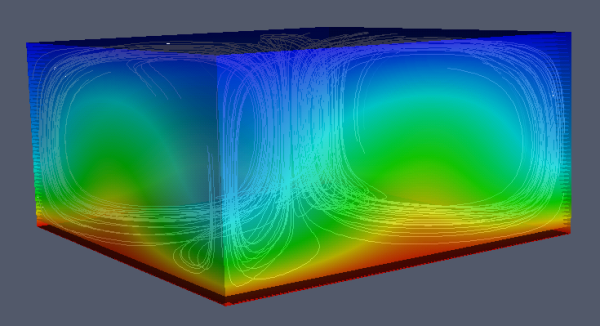

<!-- [![Contributors][contributors-shield]][contributors-url]
[![Forks][forks-shield]][forks-url]
[![Stargazers][stars-shield]][stars-url]
[![Issues][issues-shield]][issues-url]
[![MIT License][license-shield]][license-url]

 -->

<!-- PROJECT LOGO -->
 

  

  <h3 align="center">awesome computational science</h3>

  

    List of tools for Computational Science, Mathematics and Engineering
     
    OPEN SOURCE CONTENT ONLY!
  

<!-- TABLE OF CONTENTS -->

  
Table of Contents

  <ol>
    <li>
      <a href="#mesh-tools">Mesh Tools</a>
    </li>
    <li><a href="#simulation-solvers">Simulation Solvers</a></li>
    <li><a href="#ode-solvers">ODE Solvers</a></li>
    <li><a href="#nonlinear-solvers">Nonlinear Solvers</a></li>
    <li><a href="#optimization-toolkits">Optimization Toolkits</a></li>
    <li><a href="#visualization-tools">Visualization Tools</a></li>
    <li><a href="#documentation-tools">Documentation Tools</a></li>
    <li><a href="#course-materials">Course Materials</a></li>
    <li><a href="#contributing">Contributing</a></li>
    <li><a href="#license">License</a></li>
    <li><a href="#other-lists-of-interest">Other Lists of interest</a></li>
  </ol>

<!-- GETTING STARTED -->
## Programming Languages
- [C++](https://github.com/fffaraz/awesome-cpp) 
- [Python](https://github.com/TomNicholas/Python-for-Scientists)
- [Julia](https://github.com/SubhadityaMukherjee/awesomeJulia)

## Mesh Tools

- [SALOME](https://www.salome-platform.org/) - Meshing software with a GUI and a Python CLI.
- [gmsh](https://gmsh.info/) - Scalable open-source meshing software with interfaces in various languages. [[repository](https://gitlab.onelab.info/gmsh/gmsh/)]
- [meshIO](https://github.com/nschloe/meshio) - To convert between many mesh formats.

## Simulation solvers

### Finite element toolkits
  - [FEniCS](https://fenicsproject.org/) - in Python. [[repository](https://github.com/FEniCS/dolfinx)]
  - [MFEM](https://mfem.org/)
  - [deal-ii](https://www.dealii.org/) - C++ based finite element library with a very good interface for coupled problems.
  - [NGSolve](https://ngsolve.org/) - in Python.
  - [Moose](https://mooseframework.inl.gov/)
  - [KratosMultiphysics](https://github.com/KratosMultiphysics/Kratos)
  - [GridAP.jl](https://github.com/gridap/Gridap.jl)

### Miscellaneous
- [SU2](https://su2code.github.io/) - A quick-start multiphysics simulation tool.
- [OpenFOAM](https://openfoam.org/) - Popular C++ solver for fluid dynamics.
- [Pencil-Code](https://github.com/pencil-code/pencil-code) - FORTRAN based high-order finite difference solver for compressible flows.
- [VCell](https://vcell.org/) - Biological Systems modelling

## ODE Solvers

- [Sundials](https://sundials.readthedocs.io) by Lawrence Livermore National Labs, USA.
- [Trilinos](https://trilinos.github.io/) by SANDIA National Labs, USA.
- [DifferentialEquations.jl](https://docs.sciml.ai/DiffEqDocs/stable/) by far the most extensive collection and is modern. In Julia.

## Nonlinear Solvers

While there a lot of non-linear solvers out there, the choices are restricted based on the difficulty of computing the Jacobians.
Analytically obtained Jacobians are preferred, but are not easily obtained sometimes.
Automatic differentiation can sometimes be crucial for harder to differentiate functions.
The fallback is numeric differentiation solved using finite difference approximations.

- [Ceres Solver](http://ceres-solver.org/) with a good C++ API but not as many solver choices. Offers auto-diff and numeric-diff.
- [GNU Scientific Library](https://www.gnu.org/software/gsl/doc/html/index.html) a collection of many solvers and tools.
- [MINPACK](https://www.netlib.org/minpack/) is quite old, in FORTRAN, but still extensively used. Includes numeric diff.
- [PETSc SNES](https://petsc.org/release/manualpages/SNES/) - derivative computation through their Python interface can be tricky.
- [NonlinearSolve.jl](https://docs.sciml.ai/NonlinearSolve/stable/)
- [SciPy](https://docs.scipy.org/)

## Optimization Toolkits

- [Casadi](https://web.casadi.org/) - Optimization and Algorithmic Differentiation framework.
- [JAX](https://opensource.google/projects/jax) - Python package for JIT and Algorithmic Differentiation.
- [COIN-OR](https://www.coin-or.org/) - A collection of Open-source Optimization tools.
- [OSQP](https://osqp.org/) - A Quadratic Programming solver (NEW!)

## Visualization Tools

- [Matplotlib](https://matplotlib.org/) - popular Python based library.
- [TikZ/PGFPlots](https://tikz.dev/) - LateX based with some interfaces. Best for articles.
- [Plotly](https://plot.ly/graphing-libraries/) and [Dash](https://dash.plotly.com) - Plotting libs in Javascript, with various language interfaces.
- [Paraview](https://www.paraview.org/) - An all-purpose visualization tool which is sophisticated, yet simple to use.
- [Visit](https://visit-dav.github.io/visit-website)
- [PyVista](https://docs.pyvista.org/)
- [GLVis](https://glvis.org/) - FEM data visualization

## Documentation
[Tips for Reproducible Research](https://nbis-reproducible-research.readthedocs.io/en/latest/)

- [Pandoc](https://pandoc.org/) - Swiss-army knife for maintaining portable documentation.
- [IPE Editor](http://ipe.otfried.org/) - Vector graphics canvas to produce publishing quality illustrations.
- [MkDocs](https://www.mkdocs.org/) - Markdown-based software documentation and manuals.

## Course Materials
- [Stephen Boyd](https://web.stanford.edu/~boyd/teaching.html)'s courses on Matrix methods and Optimization.
- Ralf Hiptmair's course on [Numerical Partial Differential Equations course materials](https://github.com/erickschulz/NPDECODES)
- Peter Buhlmann's course on [Statistical Modeling](https://stat.ethz.ch/lectures/as20/stat-modelling.php).
- [Wolfgang Bangerth](https://www.math.colostate.edu/~bangerth/teaching.html)'s courses on Modelling, PDEs and optimization.
- [How to write Fast Numeric Code](https://acl.inf.ethz.ch/teaching/fastcode/) Course.
- [CSELab@ETHZurich Courses](https://www.cse-lab.ethz.ch/teaching/)
- [Cornell Virtual Workshop](https://cvw.cac.cornell.edu/topics) - Numerous tutorials/guides from beginner to advanced.
- [Texas Advanced Computing Center](https://learn.tacc.utexas.edu/) - Online courses on parallel programming/HPC
- [CSCS.ch on Youtube](https://www.youtube.com/user/cscsch/playlists) - Youtube Videos with plenty useful HPC/Adv programmming content.

<!-- CONTRIBUTING -->
## Contributions

Contributions are what make the open source community such an amazing place to be learn, inspire, and create. Any contributions you make are **greatly appreciated**.

* Contributions are sought especially for the grand-list in the works - check [`README-Grand`](https://github.com/ashwin-nayak/awesome-computational-science/blob/main/README-GRAND-in-the-works.md)

<!-- LICENSE -->
## License

Distributed under the CC0 License. See [`LICENSE`](https://github.com/ashwin-nayak/awesome-computational-science/blob/main/LICENSE) file for more information.

 

---

## Other lists of interest

- [#awesome-scientific-computing](https://github.com/nschloe/awesome-scientific-computing)
- [#awesome-math](https://github.com/rossant/awesome-math)
- [#awesome-datascience](https://github.com/academic/awesome-datascience)
- [#awesome-statistics-software](https://github.com/SNStatComp/awesome-official-statistics-software)
- [#awesome-python-data-science](https://github.com/krzjoa/awesome-python-data-science)
- [#awesome-computational-geometry](https://github.com/atkirtland/awesome-computational-geometry)
- [#awesome-quantum-computation](https://github.com/hsavit1/Awesome-Quantum-Computation)

<!-- MARKDOWN LINKS & IMAGES -->
<!-- https://www.markdownguide.org/basic-syntax/#reference-style-links -->
[contributors-shield]: https://img.shields.io/github/contributors/ashwin-nayak/awesome-computational-science.svg?style=for-the-badge
[contributors-url]: https://github.com/ashwin-nayak/awesome-computational-science/graphs/contributors
[forks-shield]: https://img.shields.io/github/forks/ashwin-nayak/awesome-computational-science.svg?style=for-the-badge
[forks-url]: https://github.com/ashwin-nayak/awesome-computational-science/network/members
[stars-shield]: https://img.shields.io/github/stars/ashwin-nayak/awesome-computational-science.svg?style=for-the-badge
[stars-url]: https://github.com/ashwin-nayak/awesome-computational-science/stargazers
[issues-shield]: https://img.shields.io/github/issues/ashwin-nayak/awesome-computational-science.svg?style=for-the-badge
[issues-url]: https://github.com/ashwin-nayak/awesome-computational-science/issues
[license-shield]: https://img.shields.io/github/license/ashwin-nayak/awesome-computational-science.svg?style=for-the-badge
[license-url]: https://github.com/ashwin-nayak/awesome-computational-science/blob/main/LICENSE